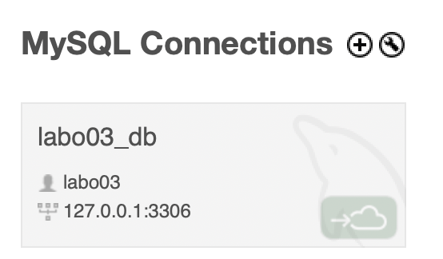
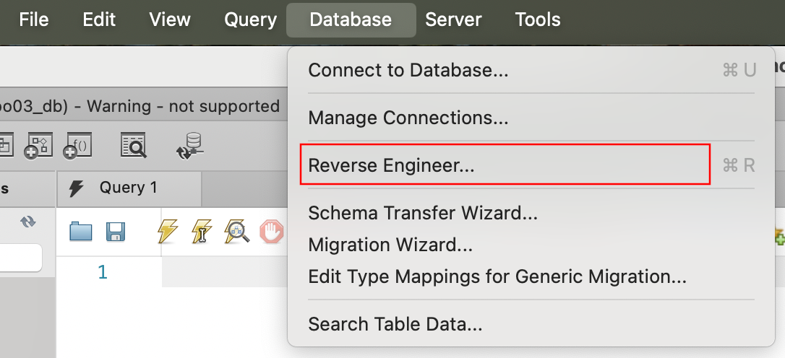
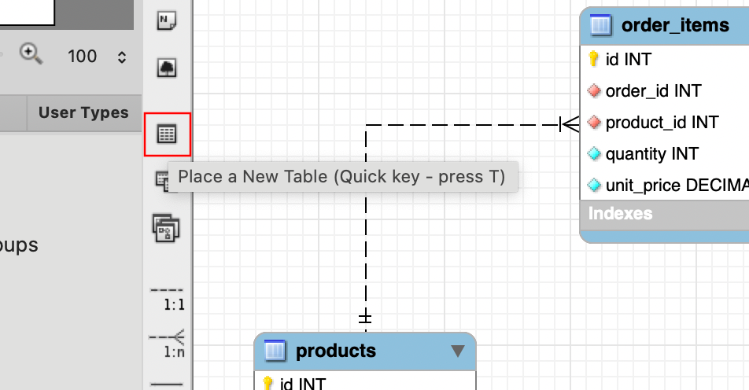
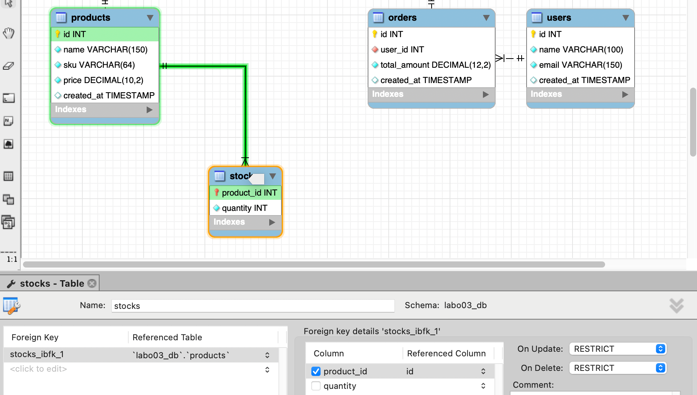

# Labo 03 – REST APIs, GraphQL

    
ÉTS - LOG430 - Architecture logicielle - Chargé de laboratoire: Gabriel C. Ullmann.

## 🎯 Objectifs d'apprentissage

- Comprendre ce qu'est une API REST et les principes RESTful.
- Comprendre comment une API peut contribuer à l'extensibilité d'une application et faciliter l'intégration de nouveaux clients.
- Apprendre comment utiliser GraphQL pour créer une API plus flexible offrant aux clients la possibilité de requêter exactement les données dont ils ont besoin.
- Comparer les avantages et inconvénients des approches REST et GraphQL selon différents contextes d'utilisation.
- Maîtriser la gestion d'état et de cache avec Redis dans un contexte d'API moderne.
- Apprendre comment utiliser MySQL Workbench pour créer les diagrammes ER (entity-relationship).
- Comprendre l'utilisation des jointures SQL avec SQLAlchemy pour optimiser les requêtes de base de données.

## ⚙️ Setup 

Dans ce laboratoire, nous poursuivrons le développement de notre application de gestion de magasin. Dans l'aspect architectural, nous transformons maintenant notre application monolithique en API avec [Flask](https://www.geeksforgeeks.org/python/flask-tutorial/) pour lui donner plus de flexibilité. Dans l'aspect fonctionnel, nous ajoutons la gestion du stock des articles, en complément de la gestion des commandes, des articles et des utilisateurs. L'application comporte désormais deux domaines : les commandes et les stocks, qui sont clairement identifiés dans la structure de répertoires (`/src/orders` et `/src/stocks`). 

> ⚠️ IMPORTANT : Avant de commencer le setup et les activités, veuillez lire la documentation architecturale dans le répertoire `/docs/arc42/docs.pdf`.

### 1. Clonez le dépôt
```bash
git clone < lien à votre dépôt GitHub >
cd log430-labo3
```

### 2. Préparez l'environnement de développement
Suivez les mêmes étapes que dans les derniers laboratoires. Créez un réseau `labo03-network`.
```bash
docker build
docker compose up -d
```

### 3. Installez Postman
[Installez Postman](https://learning.postman.com/docs/getting-started/installation/installation-and-updates/) et [importez la collection](https://www.geeksforgeeks.org/websites-apps/how-to-import-export-collections-in-postman/) disponible dans `/docs/collections`. 

### 4. Comprenez les principes REST
À ce stade, notre application est une API qui respecte presque tous les principes REST définis par Roy Fielding dans sa [thèse de doctorat (2000)](https://roy.gbiv.com/pubs/dissertation/fielding_dissertation.pdf) :

- ✅ **Client–Serveur** : séparation claire entre client et serveur.
- ✅ **Système en couches** : notre application comporte trois couches (front-end, back-end, base de données).
- ✅ **Sans état (stateless)** : chaque requête est indépendante, le serveur ne « se souvient » pas des requêtes précédentes.
- ⛔ **Cache** : il n'y a pas de mécanisme de cache côté client (nous utilisons Postman, mais cela serait possible avec un front-end).
- ✅ **Interface uniforme** : les endpoints sont bien nommés et utilisent les bonnes méthodes HTTP (POST /orders, GET /products/:id, etc.).

Une API qui respecte l'ensemble de ces principes est appelée une API RESTful. Pour l'instant, nous travaillons uniquement avec une API REST.

> 📝 **NOTE** : Roy Fielding a également travaillé sur la spécification du protocole HTTP (la [RFC 7231](https://www.rfc-editor.org/rfc/rfc7231#section-4.2.1)), qui nous utilisons pour échanger les messages dans l'internet. Nous ferons référence à ce document dans l'une des activités ultérieures.

## 🧪 Activités pratiques

### 1. Installez MySQL Workbench
Si vous ne l'avez pas encore fait, [téléchargez l'installateur](https://dev.mysql.com/downloads/workbench/) à MySQL Workbench et installez.

#### 1.1 Créez une connexion 

 

- Démarrez MySQL Workbench. Cliquez sur le bouton **(+)** et indiquez le hostname (**localhost**), le port, le nom d'utilsateur et le mot de passe de la base de données (les mêmes que dans votre `.env`). 
- Une fois les informations remplies, confirmez et double-cliquez la carte pour créer une connexion.
- Dans le panneau gauche, cliquez sur l'onglet `Schemas > labo03_db > Tables` pour voir votre liste de tables. 
- Vous pouvez exécuter des requêtes SQL si vous voulez dans le panneau droit. Par exemple :
```sql
USE labo03_db;
SELECT * FROM products LIMIT 5;
```

> 📝 **NOTE** : Si vous obtenez un `Connection Warning` lors du démarrage de la connexion, vous pouvez l'ignorer. Cela se produit parce que MySQL Workbench ne prend pas encore officiellement en charge la dernière version de MySQL.

#### 1.2 Générer diagramme ER
 

- Dans le menu supérieur, cliquez sur `Database > Reverse Engineering`.
- Gardez les options par défaut, cliquez sur `Continue` jusqu'à ce que vous voyiez l'écran `Select schemas to reverse engineer`. 
- Ensuite, sélectionnez `labo03_db`, cliquez sur `Continue` jusqu'à ce que vous voyiez l'écran `Select objects to reverse engineer`. 
- Gardez les options par défaut. Cliquez sur `Execute`, ensuite `Continue` et `Close`. Vous verrez le diagramme ER de la base de données labo 3!

L'utilisation de la fonctionnalité d'ingénierie inverse de MySQL Workbench est très utile, car elle vous fait gagner du temps lors de la création des diagrammes et, comme vous le verrez bientôt, vous permet d'intégrer facilement les modifications apportées au diagramme dans la base de données.

#### 1.3 Créez une table pour les stocks
 

- Dans le menu gauche, cliquez sur l'icône de table et ensuite cliquez sur une partie vide du diagramme pour créer une nouvelle table.
- Double-cliquez sur la table dans le diagramme pour ouvrir le panneau d'édition. Dans le champ `Name`, écrivez le nom que vous voulez donner à la table : `stocks`.
- Au bas du panneau, cliquez sur l'onglet `Columns`. Créez les colonnes `product_id` et `quantity` avec les attributs suivantes :

```sql
product_id INT PRIMARY KEY,
quantity INT NOT NULL DEFAULT 0
```

- Cliquez sur l'onglet `Foreign Keys` et créez la référence entre `stocks.product_id` et `products.id`. Cela signifie que nous ne pouvons ajouter des stocks que pour les `product_ids` qui existent dans la table `products`.

 

#### 1.4 Appliquez vos modifications
- Dans le menu supérieur, cliquez sur `Database > Forward Engineering`.
- Gardez les options par défaut, cliquez sur `Continue` jusqu'à l'écran de conclusion.
- Cliquez sur l'onglet `labo03_db`.
- Ajoutez quelques stocks en utilisant l'éditeur SQL dans MySQL Workbench pour tester :
```sql
INSERT INTO stocks (product_id, quantity) VALUES
(1, 1000),
(2, 500),
(3, 2),
(4, 90);
```
- Finalement, si tout se passe bien, retournez à votre diagramme et enregistrez-le au format `.mwb` en cliquant sur `File > Save Model As...`. Veuillez joindre le fichier lorsque vous livrez ces activités.

> 📝 **NOTE** : Vous pouvez également exporter votre diagramme au format `.svg` ou `.png`, par exemple pour l'utiliser dans vos rapports.

### 2. Testez le processus de stock complet

Maintenant que la base de données est prête, nous pouvons tester le code qui a été écrit pour l'utiliser. Dans `src/tests/test_store_manager.py`, dans la méthode `test_stock_flow()`, écrivez un [smoke test](https://www.techtarget.com/searchsoftwarequality/definition/smoke-testing) pour que nous puissions observer comment le processus de stock fonctionne, et aussi nous assurer qu'il fonctionne de manière consistante. Testez les endpoints suivants :

1. Créez un article (`POST /products`)
2. Ajoutez 5 unités au stock de cet article (`POST /stocks`)
3. Vérifiez le stock, votre article devra avoir 5 unités dans le stock (`GET /stocks/:id`)
4. Faites une commande de 2 unités de l'article que vous avez créé  (`POST /orders`)
5. Vérifiez le stock encore une fois (`GET /stocks/:id`)
6. **Étape extra**: supprimez la commande (`DELETE /orders/:id`) et vérifiez le stock de nouveau. Le stock devrait augmenter après la suppression de la commande.

Exécutez vos tests pour vous assurer que le flux de stock fonctionne correctement.

> 💡 **Question 1** : Dans la [RFC 7231](https://www.rfc-editor.org/rfc/rfc7231#section-4.2.1), nous trouvons que certaines méthodes HTTP sont considérées comme sûres (__safe__) ou idempotentes, en fonction de leur capacité à modifier (ou non) l'état de l'application. Lisez les sections **4.2.1** et **4.2.2** de la RFC 7231 et répondez : parmi les méthodes mentionnées dans l'activité 2, lesquelles sont sûres, non sûres, idempotentes et/ou non idempotentes?

### 3. Créez un rapport de stock

Le directeur du magasin qui utilise notre application a besoin de connaître l'état des articles dans le stock. Dans `src/queries/read_stock.py`, il y a une méthode `get_stock_for_all_products`, qui est utilisée par l'endpoint `/stocks/reports/overview-stocks` pour donner les stocks de chaque article, mais il n'y a pas beaucoup d'informations. Ajoutez les colonnes `name`, `sku` et `price` de l'article en utilisant la méthode [join à SQLAlchemy](https://docs.sqlalchemy.org/en/14/orm/query.html#sqlalchemy.orm.Query.join). Cela vous permettra de joindre l'information du tableau `Stock` avec `Product`.

> 💡 **Question 2** : Décrivez l'utilisation de la méthode join dans ce cas. Utilisez les méthodes telles que décrites à `Simple Relationship Joins` et `Joins to a Target with an ON Clause` dans la documentation SQLAlchemy pour ajouter les colonnes demandées dans cette activité. Veuillez inclure le code pour illustrer votre réponse.

### 4. Utilisez l'endpoint GraphQL

Dans l'activité 2, nous avons ajouté de nouvelles colonnes `Product` à un endpoint `Stock`. Si à l'avenir nous avons de nouvelles colonnes dans `Product` ou `Stock`, ou le besoin de conserver différents endpoints avec des colonnes distinctes, il faudra que nous créions différents endpoints. Pour nous aider à mieux gérer l'hétérogénéité des endpoints, on peut créer un endpoint GraphQL.

GraphQL est un langage qui nous permet de donner la possibilité aux clients qui utilisent notre API REST de continuer à utiliser les endpoints avec les noms et méthodes fixés, mais en passant les noms des colonnes qu'ils veulent. Par exemple :

```graphql
{
  product(id: "1") {
    id
    quantity
  }
}
```

L'endpoint GraphQL est accessible via `POST /stocks/graphql-query`.

> 💡 **Question 3** : Quels résultats avez-vous obtenus en utilisant l’endpoint `POST /stocks/graphql-query` avec la requête suggérée ? Veuillez joindre la sortie de votre requête dans Postman afin d’illustrer votre réponse.

### 5. Ajoutez plus d'informations à l'endpoint GraphQL

La correspondance entre les colonnes GraphQL et les données est définie dans `/schemas/query.py`, au sein de la méthode `resolve_product`. Ajoutez également les colonnes `name`, `sku` et `price` afin que les clients puissent les interroger via GraphQL. Adaptez aussi la méthode `update_stock_redis` (fichier `src/commands/write_stock.py`) afin d’enregistrer davantage d’informations manquantes sur l’article dans Redis.

> 💡 **Question 4** : Quelles lignes avez-vous changé dans `update_stock_redis`? Veuillez joindre du code afin d’illustrer votre réponse.

> 💡 **Question 5** : Quels résultats avez-vous obtenus en utilisant l’endpoint `POST /stocks/graphql-query` avec les améliorations ? Veuillez joindre la sortie de votre requête dans Postman afin d’illustrer votre réponse.

### 6. Créez un autre conteneur pour effectuer un test de communication
Pour simuler un scénario plus proche de la réalité, exécutez `scripts/supplier_app.py` dans un conteneur séparé (comme si c'était sur le serveur de notre fournisseur). Observez les résultats. Si vous avez besoin de précisions supplémentaires, référez-vous au diagramme `docs/views/deployment.puml`. Vous pouvez vous appuyer sur les `Dockerfile` et le `docker-compose.yml` déjà présents dans le répertoire `scripts`.

**Extra**: modifiez le code GraphQL dans la variable `TEST_PAYLOAD` dans `scripts/supplier_app.py` pour inclure les colonnes `name`, `sku` et `price` de l'activité 4.

> 💡 **Question 6** : Examinez attentivement le fichier `docker-compose.yml` du répertoire `scripts`, ainsi que celui situé à la racine du projet. Qu’ont-ils en commun ? Par quel mécanisme ces conteneurs peuvent-ils communiquer entre eux ? Veuillez joindre du code YML afin d’illustrer votre réponse.

### 7. Connectez une application front-end à l'API (optionnel)
Utilisez notre [projet gabarit front-end](https://github.com/guteacher/log430-frontend-template) pour interagir avec l'API. Pour utiliser ce dépôt, vous devez suivre les étapes d'installation décrites dans son fichier README. 

Cette activité n'est pas obligatoire, mais une certaine expérience en utilisent une API RESTful avec un front-end pourrait vous être utile plus tard dans le projet. Nous vous encourageons donc à l'essayer.

## Conseils de débogage
Si vous rencontrez des difficultés dans la réalisation des activités et que vous souhaitez voir plus en détail ce qui se passe dans les bases de données, vous pouvez utiliser [MySQL Workbench](https://www.mysql.com/products/community/) et [redis-cli](https://redis.io/docs/latest/operate/oss_and_stack/install/install-stack/docker/#connect-with-redis-cli) pour vérifier si les enregistrements sont correctement ajoutés/supprimés. Cependant, l'installation de ces logiciels n'est pas obligatoire pour la réalisation des activités.

## 📦 Livrables

- Un fichier .zip contenant l'intégralité du code source du projet Labo 03.
- Un fichier .mwb contenant le modèle ER de la base de données du projet Labo 03.
- Un rapport en .pdf répondant aux questions présentées dans ce document. Il est obligatoire d'illustrer vos réponses avec du code ou des captures d'écran/terminal.
